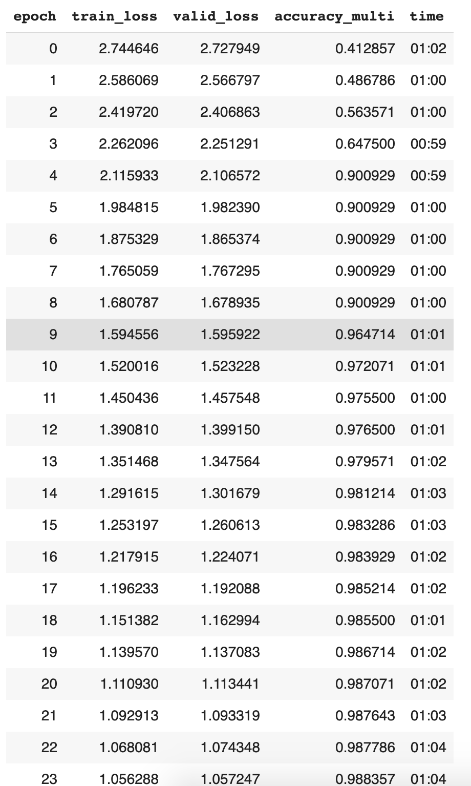
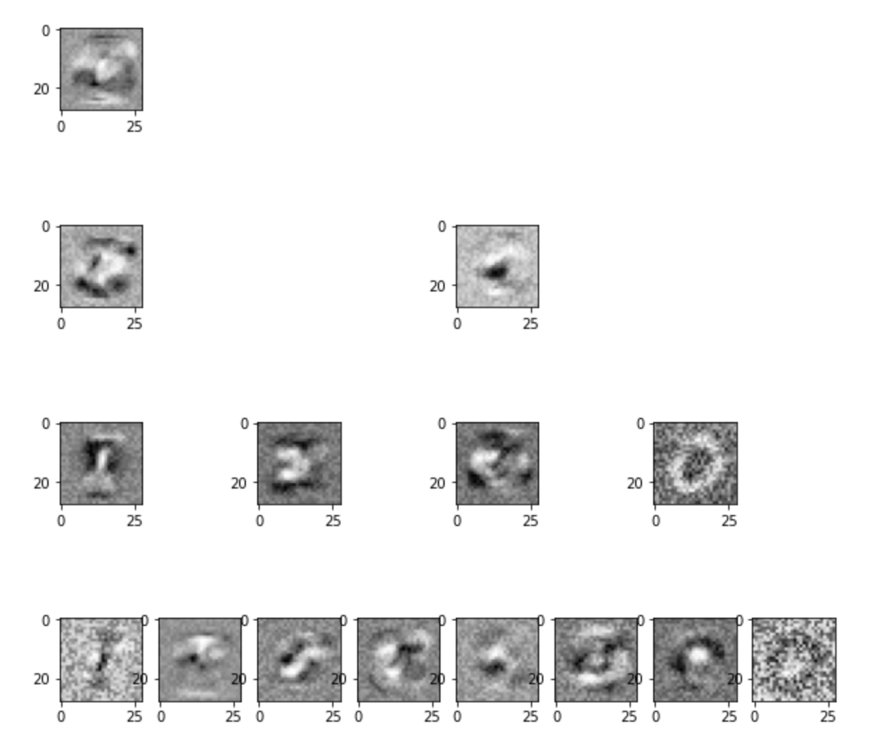

# SDT
> This package is an implementation of the paper [Distilling a Neural Network Into a Soft Decision


```
# ignore
if IN_COLAB:
  from google.colab import drive
  drive.mount('/content/drive')
```

    Drive already mounted at /content/drive; to attempt to forcibly remount, call drive.mount("/content/drive", force_remount=True).


## Install

`pip install git+https://github.com/numb3r33/sdt.git`

## How to use

```
#ignore
path = untar_data(URLs.MNIST)
dls  = get_dls(path, bs=128)
```

```
#ignore
current_depth = 0
depth = 4

tree      = Tree(input_dim=784, output_dim=10)
n_leaves  = 2 ** depth
n_classes = 10
n_epochs  = 40

tree = sdt_init(current_depth , depth, tree, input_dim=784, output_dim=n_classes)

# SDT
sdt       = SDT(tree=tree, n_leaves=n_leaves, n_classes=n_classes)
criterion = SDTLoss(lambda_=0.05)
```

```
#ignore
learn = Learner(dls, 
                sdt, 
                loss_func=criterion, 
                opt_func=partial(SGD, lr=.2, mom=0.9), 
                cbs=SDTCallback(tree, n_leaves), 
                metrics=partial(accuracy_multi, sigmoid=False))
```

```
#ignore
learn.fit_one_cycle(n_epoch=n_epochs)
```



## Learned Filters


